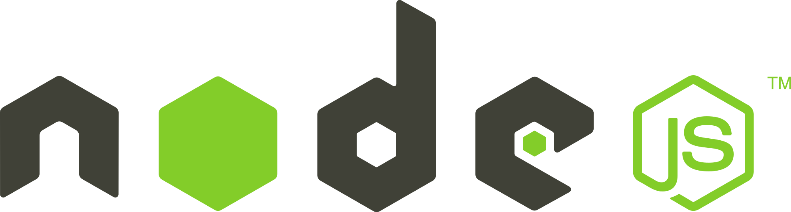

# Typeracer 🖮

Typeracer, an online platform to create your own competitive session or join random sessions of Typing Speed Tests.

## Developement
- Fork the repository and then follow the instructions:

```sh
$ git clone https://github.com/{{your_username}}/Typeracer.git
$ cd Typeracer
$ git remote add upstream https://github.com/aashutoshrathi/Typeracer.git
```
## How it Works ?

Coming soon

## Technologies Used

- [](https://www.firebase.com/)
- [](https://vuejs.org/)
- [](https://nodejs.org/en/)
- [](https://developers.google.com/identity/protocols/OAuth2)

## Author ✍️
<details>
	<summary>Team  MA<sup>2</sup>P</summary>
		<ul>
			<li><a href="https://github.com/violentdelight">Mohak Khare</a></li>
			<li><a href="https://github.com/llGurudevll">Ajay Guru</a></li>
			<li><a href="https://github.com/aashutoshrathi">Aashutosh Rathi</a></li>
			<li><a href="https://github.com/prithaupadhyay">Pritha Upadhyay</a></li>
		</ul>
</details>

## Contribute
Found a bug, please [create an issue](https://github.com/aashutoshrathi/Typeracer/issues/new)

## How can I support developers?

- Star our GitHub repo 🌟
- Create pull requests, submit bugs, suggest new features or documentation updates 🔧

We're always happy to receive your feedback!

## License

[](https://github.com/aashutoshrathi/Typeracer/blob/master/LICENSE)
> © [Aashutosh Rathi](https://github.com/aashutoshrathi)